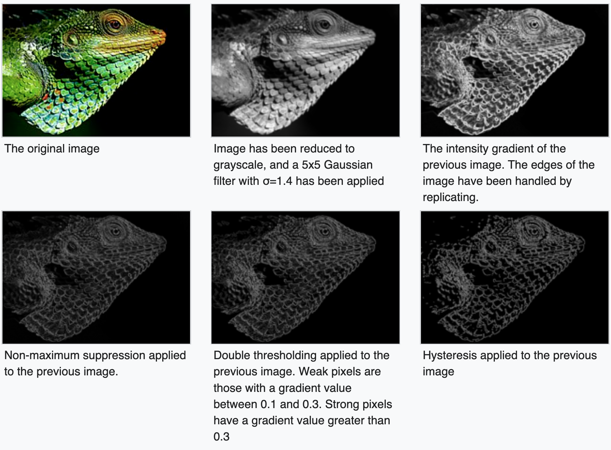

Canny edge detector
================================

## Requirements

1. Take pictures of a B&W chessboard at a high resolution (eg. 3000x4000)
2. Apply your Canny edge detector to these images (grey only) with accuracy to pixel level (integer)
3. Reduce the size to ¼ of the original image (eg 750x1000), then apply the Canny edge detector with sub-pixel accuracy. The output is a list of edge pixels with decimal points numbers. 
Casting these edge pixels to its original size of 3000x4000 and make a comparison with the results obtained in 2. Discrepancies can be presented in the report/during the face-to-face assessment.
4. Repeat the above to photos with daily life settings.

## Algorithm
The process of Canny edge detection algorithm can be broken down to five different steps:

<p align="center">
    
</p>

1. Apply Gaussian filter to smooth the image to eliminate noise.   

    * The larger the width of the Gaussian mask, the lower is the detector's sensitivity to noise
    * Convolve the filter over the image 

2. Find the intensity gradients of the image; image gradient to highlight regions with high spatial derivatives

3. Apply gradient magnitude thresholding or lower bound cut-off suppression to get rid of spurious response to edge detection

4. Apply double threshold to determine potential edges

5. Track edge by hysteresis: Finalize the detection of edges by suppressing all the other edges that are weak and not connected to strong edges.

## Technical specs

1. Image handler

    Handles all the basic operations on an image

    Eg. Loads the image, saves the image, resize the image

2. Canny edge detector (Refer to the algorithm)

## Development

1. Setup the dev environment

    *Prereq: Miniconda was used to setup the development environment.*

    ```bash
    > conda create --name canny python=3.8
    > conda activate canny
    > pip install -r requirements.txt
    ```

2. Run the tests 

    ```bash
    > pytest -v
    ```

## References

1. [Canny Edge Detector, Wikipedia](https://en.wikipedia.org/wiki/Canny_edge_detector)
2. [Bill Green, Canny Edge Detection Tutorial, Drexel Autonomous Systems Lab., 2002.](http://masters.donntu.org/2010/fknt/chudovskaja/library/article5.htm#:~:text=Based%20on%20these%20criteria%2C%20the,the%20maximum%20(nonmaximum%20suppression)).